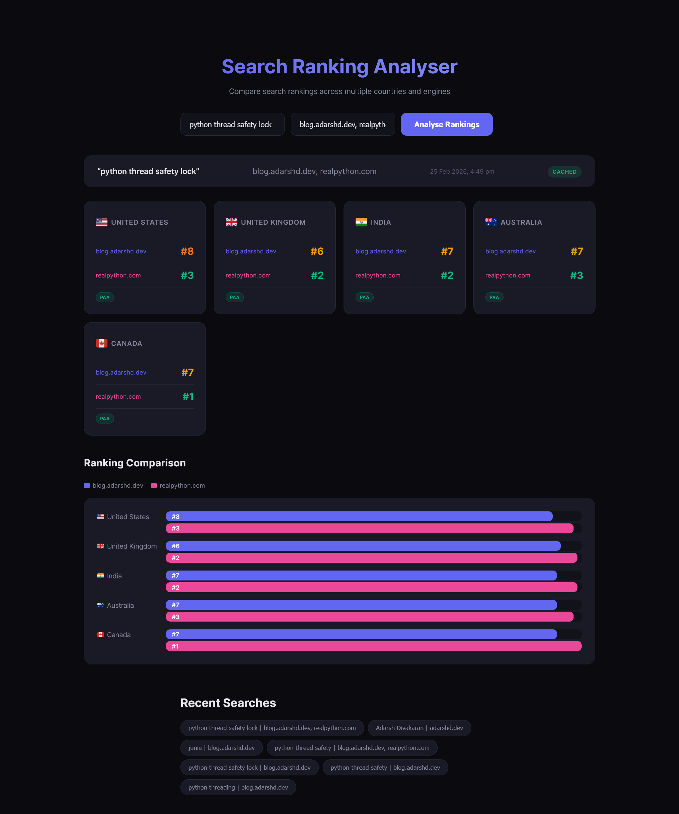

# Search Ranking Analyser

A web app that checks where a domain ranks on Google across multiple countries. Enter a search query and a domain, and it queries Google via SerpAPI for the US, UK, India, Australia, and Canada, then shows the ranking position in each country with visual cards and a bar chart.

## Vibe Coded With Claude


This project was built with [Claude Code](https://claude.com/claude-code), Anthropic's CLI tool for AI-assisted development. The implementation plan, backend, frontend, and styling were all generated through conversation with Claude. SerpAPI Python SDK source code was added to the project's dependency docs folder using [gitingest.io](https://gitingest.io) to give Claude full context on the API.


## APIs Used

The app uses two SerpAPI endpoints:

- **Google Search** (`engine: google`) — Fetches the organic search results for a query in each of the 5 target countries. The backend parses these results to find where the given domain ranks.
- **Google Autocomplete** (`engine: google_autocomplete`) — Powers the search suggestions dropdown. As you type in the query field, the app hits this endpoint to show real-time autocomplete suggestions from Google.

Both endpoints go through SerpAPI's `serpapi` Python SDK and results are cached to disk to avoid redundant API calls.

## How It Works

The FastAPI backend receives a search query and domain, then hits SerpAPI's Google Search endpoint for each of the 5 countries (searching the top 100 results for better coverage). It finds where the given domain appears in the organic results and returns the position, title, URL, and snippet. Results are cached as JSON files on disk so repeated searches don't burn API credits.

The frontend is vanilla HTML, CSS, and JS with a dark theme. Rankings are displayed as colour-coded cards (green for top 3, yellow for 4-7, orange for 8-10, red for beyond 10, grey for not found) alongside a horizontal bar chart. Search history is saved to localStorage for quick re-runs.

## Tech Stack

- **Backend:** Python 3.14, FastAPI, Uvicorn
- **Frontend:** HTML, CSS, JavaScript (no frameworks)
- **API:** SerpAPI (Google Search)
- **Caching:** File-based JSON cache with MD5 keys

## Setup

1. Install dependencies:
   ```bash
   pip install fastapi uvicorn google-search-results
   ```

2. Set your SerpAPI key:
   ```bash
   export SERPAPI_KEY=your_key_here
   ```

3. Run the server:
   ```bash
   python server.py
   ```

4. Open http://127.0.0.1:8000 in your browser.

## Results


